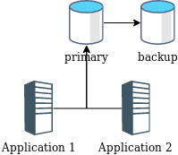
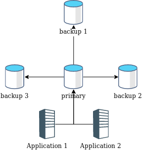
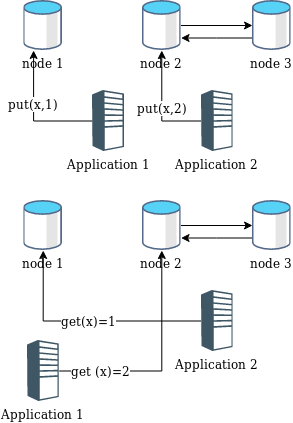
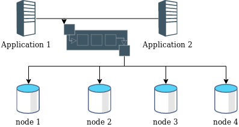

# 分布式系统实践入门：以实现一个分布式键值服务为例

>“What I cannot create, I do not understand.” – Richard Feynman

🚧注意：非终稿，不定期更新。

## 背景

所谓分布式系统，是由多台机器通过网络通信协同完成相关功能的系统。存在多台机器的原因可能有：

- 系统各个模块的所有者、运行环境、架构体系、发布频率等客观条件不同，需要多台机器。
- 单机无法满足性能或容量要求，需要多台机器。
- 使系统对某些软硬件错误实现容错。

其中，容错经常和高可用、灾备混淆。可以通过例子简单的[区分](http://www.pbenson.net/2014/02/the-difference-between-fault-tolerance-high-availability-disaster-recovery/)：

- 灾备：发生故障后（小到硬盘损坏，达到机房火灾），后期业务的恢复能力。如飞船救生舱。
- 高可用：系统发生故障后，可以快速恢复。如汽车的备胎。
- 容错：系统允许某些故障发生，并且保证在修复前，用户功能不受影响。如大型客机的多引擎设计。

在软件设计中，“容错”难度较大，实现容错的技术及思想，常常也用在高可用和灾备的设计中。

那么：**实现一个以容错为目标的分布式系统，有哪些挑战和应对手段？**

本文以kv服务为例，首先分析常见的副本设计问题、解决办法和局限，然后讲解实现一个单机kv服务的关键细节，
在此基础上，再讲解使用复制状态机实现的可容错分布式kv服务。

项目源码及构建、运行方式请参看：[项目主页](https://github.com/z42y/parliament/)，同时提供了[javadoc参考](https://z42y.github.io/parliament/javadoc//index.html)。

欢迎在github提出建议！👏 

## 目标

该服务除了实现常见的"SET _key_ _value_"、"GET _key_"、"DEL _key0_  \[_key1_ ...\]"操作，
还实现了按范围取值的命令"RANGE _begin_ _end_"，其中begin和end为开始、结束key值，字典序排序。

服务使用redis的resp协议进行通信，可以直接使用redis-cli等客户端连接测试。

该服务有容错能力，并且同时保证顺序一致性：

>the result of any execution is the same as if the operations of all the processors were executed in some sequential order, and the operations of each individual processor appear in this sequence in the order specified by its program. - - Lamport

- 执行结果是所有进程的操作按某个顺序执行的执行结果。
- 每个进程的操作，在上面的顺序中，与该进程程序指定的顺序一致。

比如，客户端1执行：

	put(x,1),put(y,2),get(x),get(y)
	
客户端2执行：

	put(z,3),put(y,3),get(x),get(z)
	
在服务器上可能的一种结果是：

	put(x,1),put(z,3),put(y,2),put(y,3),get(x),get(y),get(x),get(z)
	
以下结果是顺序一致性不允许的：
	
	put(x,1),put(y,2),put(y,3),put(z,3),get(x),get(z),get(x),get(y)
	
因为put(z,3)发生put(y,3)后面，这不是客户端2程序指定的顺序。

不同客户端看到不同的总体执行顺序也是不允许的。

这些系统对客户端作出的保证就是系统的一致性模型，不同系统有不同的[一致性模型](https://zh.wikipedia.org/wiki/%E5%86%85%E5%AD%98%E4%B8%80%E8%87%B4%E6%80%A7%E6%A8%A1%E5%9E%8B)，这里的保证属于顺序一致性。

一致性模型有强弱之分，一致性越强，对应用程序或程序员越友好，但是实现难度更大，性能更差；反之，一致性越弱，一般实现更简单，性能更好，但对应用者更加不友好、更不可预测，我们在下面将体会到这点。

## 从灾备到容错

### 主从复制

对于键值服务等数据类型应用，主从复制是最常见的灾备手段，一台机器提供服务，另一台机器通过网络对这台机器的数据进行本地备份。
如图：



主从复制分为同步方式和异步方式，同步方式是指请求备份成功后返回成功，异步是指先返回结果再进行同步。

### 单点故障

主从机器中任何一台出现故障，都需要暂停服务，恢复后，才能继续提供服务，否则可能出现数据丢失的问题。

可以提供多台从节点提高可用性，只要有一台从节点可用，服务可以不用暂停。
如图：



但是某些节点和网络链路可能一会儿正常，一会儿失败，导致节点数据不一致，需要额外的工作使各个从节点数据最终一致。

除了这个问题，主从复制方案还存在单点故障问题，只要主节点失败，整个服务都不可用，无法满足我们的容错需求。

## 副本容错

为了容错，我们可提供多个服务进程的副本，收到请求的节点使用某种格式的日志记录该请求，并同步给各个节点执行。

当某个节点宕机或网络不可达时，另一个节点可以继续为客户提供服务，宕机节点恢复后，
它可以从其他节点获取宕机后的日志进行回放，赶上其他节点的状态。

### 网络分区的问题

但是，网络分区会使得不同客户端可能会使用不同节点进行读写请求，如：



某个时候开始，节点1与其他节点无法通信，分为两个网络，
应用1先在节点1的网络分区，应用2在节点2的网络分区，执行写操作，
接着，应用1和2的分区同时进行了切换，进行另一步的读操作。

```
应用1：put(x,1),get(x)=2
应用2：put(x,2),get(x)=1
```

以上结果违背了顺序一致性，应用1的get(x)=2说明应用2的put(x,2)已执行，应用2的get(x)返回值应为2。

如果发生写冲突后能够立刻发现和解决冲突，还是能满足较强一致性的。
一种方案是一次写操作需写入w个节点，读操作读取r个节点，保证r+w>n(系统所有节点的个数），就一定能发现冲突。如图：


上图应用2在节点3的读取操作便发现了冲突，客户端需要某种策略确定保留一个版本。

一种常见思路是更新时带上该数据更新时间，服务端使用最新版本，但是在分布式系统里，时钟是不可靠的，每台机器的时钟不可能完全同步，做到接近的代价都很大。

不可靠的时钟，举个例子，一个功能需要应用1先执行：

```
put(x,1)
``` 

接着应用2执行：

```
get(x);
if x == 1:
	put(x,2)
```

但由于应用2的时钟比应用1慢100毫秒，导致put(x,2)被作为旧版本数据被丢弃，这不是一种顺序执行的结果，
违反了顺序一致性。[逻辑时间](https://en.wikipedia.org/wiki/Logical_clock)是一种解决分布式时间问题的办法。

除此之外，如果某个客户端应用无法连接w个节点和r个节点，则服务对该客户端不可用，
如果要提高可用性，可以在该客户端所在网络分区没有w个节点时，新建副本满足要求，
但这将破坏系统的一致性，亚马逊DynamoDB就是这种实现方式。

所有分布式系统，都存在着这种一致性和可用性之间的[权衡](http://dbmsmusings.blogspot.com/2010/04/problems-with-cap-and-yahoos-little.html)。

虽然可以通过逻辑时间标记数据版本解决一致性问题，但是对于复杂应用，如分布式数据库的SQL操作，
逻辑时间解决起来是很复杂的。

## 复制状态机

另一种想法是选举一个Leader接收请求，当前不是Leader的节点拒绝客户端请求。
但是，如何保证每个客户端的Leader是一样的呢？如果在请求过程中，Leader发生了变化呢？

可以看到，要满足顺序一致性，Leader更新过程本身也是操作的一部分，和其他业务请求面对的问题一样。如下所示：

	put(x,1),leader(server 1),put(x,2),leader(server 2)

这个问题的本质是，所有节点在执行一个特定请求时，他们的状态必须是一样的。
**如果将进程看做一个状态机，那么在前面输入都相同的情况下，当前输入的输出结果一定是一样的**。

这便是复制状态机的思想：



### 共识问题

如果对复制状态给的输入进行递增编号，只要保证每个节点对相关编号的输入内容达成一致，即可实现复制状态机，这种做法称为全序广播或原子广播。
全序广播可以保证顺序一致性。

这就把问题变成了一个典型的分布式共识问题：

>异步系统中，多个进程对某一个提案的内容达成一致的过程，就是共识。

协商**每个**编号操作内容的过程，就是**一次**分布式共识达成过程，因此全序广播问题又等价为共识问题。

在可能存在网络分区的异步网络中，常见的共识算法有Paxos和raft，我们使用Paxos共识算法。

## 理解Paxos

Paxos算法的推导过程就是一个为了得到结果，不断对条件进行约束的过程。

首先，某个节点作为发起者（proposer），对其他节点发起提案，接收者需要满足**约束P1**：

> P1：一个 acceptor 必须接受（accept）第一次收到的提案。
    
显然，违反P1的系统，不会通过任何提案被通过。

但如果网络分裂为A和B两个网络，A和B不能互通，一个提案在A得到批准，另一个提案在B网络得到批准，则会出现提案不一致的情况。
解决方案是只批准获得超过一半（大多数）接收者同意的提案。

但是A和B网络可能有重叠，此时某些节点可能会收到两个或两个以上的提案，这些节点必须能够接受这些两个及以上的提案，因为按照约束P1，
这些提案可能是其他节点的第一个提案，已经被接受了。

为了区分提案，需要为提案分配编号，比如发起节点的本地序列号+ip地址。**这里不要混淆提案的编号和复制状态机输入的编号，
状态机每个编号（依次递增）的输入内容对应一次共识过程，该共识过程可能存在多个编号（只需保证单调）的提案**。

既然接收者需接收多个提案，这就引出**约束P2**：

>P2：一旦一个具有 value v 的提案被批准（chosen），那么被批准（chosen）的更高编号的提案必须具有 value v。

提案被批准，表示至少被一个接收者接受过。所以加强P2，得到约束**P2a**：

>一旦某个提案值v获得批准，任何接收者接收的更高编号的提案值也是v。
    
因为通信是异步的，一个从休眠或故障恢复的节点，给某个尚未收到任何提案的节点，提交一个更高编号的不同提案v1，按照约束P1，该节点必须接收该提案，
这就违背了约束P2a，所以，与其约束接收者，约束提交者更加方便，对P2a加强约束，得到约束**P2b**：

>一旦某个提案值v获得批准，任何发起者发起的更高编号的提案值必须是v。

我们来证明P2b如何保证P2。

使用归纳法，假设编号为m（m < n）的提案被选中，且m到n-1的提案值都为v，那么存在一个大多数接收者的集合C接收了m提案，这意味着：

>C中每个接收者都批准了m到n-1其中一个提案，m到n-1的每个被批准的提案其值都是v。

因为任何大多数接收者集合S，和C至少有一个公共接收者，编号为n的提案w被批准，那么只有两种情况：

>1. 存在一个包含大多数接收者的集合S，从未接受过小于n的提案。
>2. w和S中所有已接受的、编号小于n的最大编号提案值相同，即值为v。因为公共接收者需要批准相同的提案值。

这个证明看起来很多余，但是请注意，编号m到n的提案不是按编号先后顺序发起的，这些提案的发起顺序是没有保证的。

编号为n提案的发起者需要知道所有已接受提案中小于n的最大编号提案的值（如果有）。知道已接受的提案是值很简单的，预测未来很难办，
比如：编号为n的提案值，如何知道尚未收到的n-1编号提案的值呢。

与其预测未来，不如让接受者在之后拒绝所有小于n的提案。

由此强化约束P1，得到**P1a**:
    
>接收者拒绝接受编号比当前已知最大编号n更小的提案。

得到paxos算法过程如下：

1. prepare阶段：
    1. 发起者选择一个提案编号n并将prepare请求发送给接收者中的一个多数派；
    2. 接收者收到prepare消息后，如果提案的编号大于它已经回复的所有prepare消息(回复消息表示接受accept)，
则接收者将自己上次接受的提案回复给发起者，并承诺不再回复小于n的提案；如果没有回复过prepare消息，也承诺不再回复小于n的提案。
2. accept阶段：
    1. 当一个发起者收到了多数接收者对prepare的回复后，就进入批准阶段。
 它要向回复prepare请求的接收者发送accept请求，包括编号n和prepare阶段返回的小于n的最大提案的值。
    2. 如果accept的提案编号n大于等于接收者已承诺的编号值，接收者就批准这个请求。
    3. accept被多数派批准后，发起者再通知所有接收者提案已批准（decided)的消息。

我们对每个客户端请求不断使用以上算法，即可对每个编号的操作内容达成共识。这当然会导致某些客户提交的请求失败，但是可以通过客户端重试解决。

Paxos还存在一些优化技巧，减少通信次数，这里不实现，具体可参考相关资料。

## 键值服务的代码实现
提供服务的第一步是接受、解析客户端通过网络发送的命令请求，使用JAVA NIO处理。

### JAVA NIO的使用
首先打开socket接收客户连接，在连接成功的channel上挂载一个[RespReadHandler](https://z42y.github.io/parliament/javadoc//io/github/parliament/resp/RespReadHandler.html)类，
使用[RespDecoder](https://z42y.github.io/parliament/javadoc//io/github/parliament/resp/RespDecoder.html)类对异步到来的字节报文进行解码，RespReadHandler使用其get方法，判断是否解码完成。

解码完成后，使用[KeyValueEngine](https://z42y.github.io/parliament/javadoc//io/github/parliament/kv/KeyValueEngine.html)进行真正的键值读写处理，此处先不考虑KeyvalueEngine的实现细节。

执行完客户端命令后，ReadHandler新建一个[RespWriteHandler](https://z42y.github.io/parliament/javadoc//io/github/parliament/resp/RespWriteHandler.html)将结果返回给客户端，
接着重新挂载一个RespReadHandler进行下一个请求处理。

重新生成RespWriterHandler和RespReadHandler是为了方便进行GC，当然可以手工管理各种buffer的回收和重利用，这里不做详细设计了。

因为保存的对象都比较小，[KeyValueEngine](https://z42y.github.io/parliament/javadoc/io/github/parliament/kv/KeyValueEngine.html)并没有使用InputStream之类的模式进一步提升异步性能。

### 网络协议的解析构造
[RespDecoder](https://z42y.github.io/parliament/javadoc/io/github/parliament/resp/RespDecoder.html)是redis的[RESP协议](https://redis.io/topics/protocol)解码器，
RESP一共有以下几种数据类型：

- SIMPLE_STRING 字符串
- ERROR 错误字符串
- INTEGER 整数
- BULK_STRING 二进制字节组
- ARRAY 数组

除了ARRAY可以包含其他类型和其他ARRAY，处理稍稍麻烦外，其他类型都容易解析。

使用JAVA标准库中ByteBuffer类直接解析协议是比较困难的，因为报文的写入和读取是并发的，不可能等到报文读取完成后，才开始解析，
甚至无法知道报文什么时候结束。

另外，报文处理往往需要"回溯"操作，从之前某个位置重新开始解析。使用ByteBuffer的flip和rewind、reset太底层，抽象层次不够。

所以通过实现自己的[ByteBuf](https://z42y.github.io/parliament/javadoc/io/github/parliament/resp/ByteBuf.html)进行报文解析，主要提供了独立的读写index，方便回溯和读写操作分离。
底层使用byte[]保存数据，也可以使用direct allocate的ByteBuffer提升性能，但是ByteBuf的生命周期短、数据量都小，无法体现其优势。

## 键值命令实现
收到请求后，需要执行GET和PUT、DEL、RANGE操作，这些操作都是典型的有序Map方法，比如JDK中的[NavigableMap接口](https://docs.oracle.com/javase/9/docs/api/java/util/NavigableMap.html)，
其并发实现[ConcurrentSkipListMap](https://docs.oracle.com/javase/9/docs/api/java/util/concurrent/ConcurrentSkipListMap.html)采用了skip list算法，
本应用也采用该算法。

skip list（跳表）平均查找和插入时间复杂度都是O(log n)，算法说明见[wikipedia](https://zh.wikipedia.org/wiki/%E8%B7%B3%E8%B7%83%E5%88%97%E8%A1%A8)。
该算法通过维护多层链表，依次快速接近查找目标。

演示（来自Wikipedia）：


### skip list的持久化实现
在内存中实现skip list的数据结构非常简单，使用文件接口的持久化实现则需要考虑很多细节，这里的实现不考虑并发。

首先需要考虑如何使用文件表示链表结构，每个节点需要知道下一个节点位置，
对于内存实现的skip list，编程语言的指针或引用处理起来非常自然，使用文件实现，我们需要手工分配和管理节点在文件中的地址和存储。

以skip list的插入操作为例，一种简要的步骤如下：

- 获得最上层链表的头节点的文件名称和位置信息，文件名和位置信息可以记录在其他元信息文件中。
- 获得头节点的key值，与参数key比较，以决定继续查找同层下一个节点还是进入下一层链表。
    - 节点中key的长度不是固定的，文件中需要区分key值、地址内容，可以使用某固定字段保存key长度，以便程序快速定位。
- 到达底层节点后，寻找插入位置。
    - 底层节点需要保存key对应的value值，可以保存在节点中（同样需要使用某个固定字段保存value长度），也可以保存在其他地方，使用地址进行查找，但这样会多一次磁盘寻址操作。
    - 待插入位置可能在链表中间，文件接口没有insert之类的操作，为了后续节点不被覆盖，需依次拷贝后续节点到文件中的新位置。
    - 更改节点位置后，需要更新相关节点保存的该节点的位置信息。
    
可以看到，按照文件物理位置进行地址管理，维护位置信息非常麻烦，我们希望新节点的分配不会改变原有节点的物理位置，
同时希望即便更新了相关节点的物理位置后，不用更改其他节点对该节点的引用。

参考内存管理中不同进程共享相同地址空间的方式，采用一个映射表，对每个节点分配一个唯一编号表示虚拟地址，在映射表中保存该虚拟地址的文件物理位置。
这样，在文件中移动节点后，只需更新映射表中该节点的映射信息。分配新空间时，也不用按照逻辑位置决定物理空间的位置。

解决了地址问题，该方案另一个问题是效率低下，无论查找和更新，都需要读取很多次磁盘，磁盘的读写时间比内存读写时间高三个数量级。

每个node对应一个地址，空间上不太经济，1万个节点至少需要8万个字节的映射空间（编号+地址）。

另外，大部分存储设备是以"块"（block）为读写单位的，块的大小常见有4K bytes、8K bytes等，文件系统一般以设备的块大小的整数倍为读写单位。
单个node的文件读写无法发挥块设备的性能优势。

同时，文件系统对单个文件的大小也有限制。

### Page管理
结合以上分析，我们按文件系统的块大小为单位分配文件空间，一个块大小的空间称为page，每个page有一个唯一编号，使用heap（堆文件）管理page，heap文件可能有多个，
在一个page上托管多个实际的skip list节点。

每个heap文件的结构如下：
```
|------------------heads------------------------|---------pages-------|
| page number (4字节) | page location (4字节)|.. | page | page |...|...|
```

#### 初始化
第一次运行会运行pager的init方法，通过该方法指定heap存储目录、每个heap文件的最大字节数、每个page的字节数进行存储目录的初始化，
在目录中使用metainf保存字节数信息，使用page_seq文件保存当前最大page编号，以便在进程重启时恢复page管理。

#### Page寻址及分配
Pager的allocate方法首先使用空闲page的编号（从metainf尾部获取空闲page编号），没有空闲page则递增page_seq，获得一个新的page编号，
通过page编号查找到对应的heap文件，如果heap文件不存在，则初始化，从heap文件构造一个Heap对象。

Heap对象的头部heads成员将page编号映射为page在该heap文件的偏移地址，如page未分配，则偏移为-1。

新建page从heap尾部分配，分配后更新head信息并持久化到heap文件。

### SkipList的查找
一个page中包含多个skip list节点，为了提高读写速度，一般将page缓存到内存中，更新后，写回文件，这里使用weak reference的cache缓存page。

skiplist.mf保存了每层首节点的编号，由SkipList.init方法进行初始化。

page被加载到内存后，各个节点转换为JDK NavigableMap包含的条目，以便page中快速查找定位。
skip list的上层节点和底层节点的值含义不同，上层节点的value表示下一个节点所在page的编号，底层节点的value表示真正保存的值。

不管查询还是写入、删除，都需要先定位节点所在page页面，如查找某key在某层级的page，代码如下：
```{.java}
private SkipListPage findSkipListPageForKey(byte[] key, int lv) throws IOException, ExecutionException {
    Preconditions.checkArgument(lv >= 0);
    Preconditions.checkArgument(lv < SkipList.this.height);
    int cursor = height - 1;
    SkipListPage start = null;
    SkipListPage up = null;
    while (cursor >= lv) {
        up = start;
        if (start == null) {
            start = skipListPages.get(startPages[cursor]);
        }
        SkipListPage slice = floorPage(start, key);

        if (cursor == lv) {
            return slice == null ? start : slice;
        }
        if (slice != null) {
            Map.Entry<byte[], byte[]> e = slice.map.floorEntry(key);
            int pn = ByteBuffer.wrap(e.getValue()).getInt();
            start = skipListPages.get(pn);
            start.setSuperPage(up);
        } else {
            start = null;
        }

        cursor--;
    }

    return start;
}
```
这个方法还负责更新相关page的上一层page信息。

floorPage从指定page开始查找拥有最后一个小于等于待查找值的key所在的page，实现如下：
```{.java}
private SkipListPage floorPage(SkipListPage start, byte[] key) throws ExecutionException {
    SkipListPage current = start;
    SkipListPage floor = null;
    while (current != null) {
        Map.Entry<byte[], byte[]> entry = current.map.floorEntry(key);
        if (entry != null) {
            // 只是在本page发现小于key的记录，还需检查下一页。
            floor = current;
        }

        if (current.getRightPageNo() > 0) {
            int pn = current.getRightPageNo();
            current = skipListPages.get(pn);
        } else {
            current = null;
        }
    }
    return floor;
}
```
注意，如果在该page对应map未找到大于查找值的记录，还需要到下一个page查找。

### SkipList的更新
更新一个节点前，先使用以上方法查找、加载待插入的page，更新相关map，再使用SkipListPage.update更新文件，代码如下：
```{.java}
private void update() throws IOException, ExecutionException {
    int s = HEAD_SIZE_IN_PAGE;
    int k = 0;

    for (byte[] key : map.keySet()) {
        s += key.length;
        s += 4;
        s += map.get(key).length;
        if (isLeaf) {
            s += 4;
        }
        k++;
    }
    size = s;
    keys = k;
    if (keys == 0) {
        pager.recycle(page);
    }

    if (remaining() < 0) {
        split();
    } else {
        sync();
    }
}
```

如上所述，如果page不在包含数据，则回收，如数据已超过page大小，则分裂page，分裂方法为分配一个page，并将除头节点以外的节点存储到新page即可。
```{.java}
private void split() throws IOException, ExecutionException {
    Preconditions.checkState(this.keys > 0);
    Preconditions.checkState(!map.isEmpty());
    Page p = SkipList.this.allocatePage(level);
    SkipListPage newPage = skipListPages.get(p.getNo());

    newPage.map = new ConcurrentSkipListMap<>(map.tailMap(map.firstKey(), false));
    Preconditions.checkState(!map.isEmpty());
    map = new ConcurrentSkipListMap<>(map.headMap(map.firstKey(), true));
    newPage.rightPageNo = this.rightPageNo;
    this.rightPageNo = newPage.getPage().getNo();

    this.update();
    newPage.update();

    Preconditions.checkState(pager.getPageSize() - this.getSize() >= 0);
    Preconditions.checkState(pager.getPageSize() - newPage.getSize() >= 0);
}
```

注意，文件写入不是原子的，可能只写入了部分数据便宕机了，不完整的数据会导致进程无法恢复原有状态，
，persistence()需要保证要么完全写入，要么完全不写，

AtomicFileWriter类实现了原子写入，并在进程启动时进行检查和恢复。

 
## 实现复制状态机
[KeyValueEngine](https://z42y.github.io/parliament/javadoc/io/github/parliament/kv/KeyValueEngine.html)收到请求，不会立即执行，
而是交给[ReplicateStateMachine](https://z42y.github.io/parliament/javadoc/io/github/parliament/ReplicateStateMachine.html)生成一个新的状态机输入，
并委托ReplicateStateMachine对该输入所在编号的操作达成共识，由ReplicateStateMachine回调KeyValueEngine接口执行，返回结果。

```{.java}
Input input = rsm.newState(bytes);
CompletableFuture<Output> future = rsm.submit(input);
return future.thenApply((output) -> {
    try {
        if (!Arrays.equals(input.getUuid(), output.getUuid())) {
            return RespError.withUTF8("共识冲突");
        }
        return RespDecoder.create().decode(output.getContent()).get();
    } catch (Exception e) {
        logger.error("get submit result failed:", e);
        return RespError.withUTF8("get submit result failed:" + e.getClass().getName()
                + ",message:" + e.getMessage());
    }
});
```
如果达成的共识内容不是提交的内容，返回客户端错误，客户端可以决定重试或报错。

这里需要注意，每个客户端的请求需要分配独立的id，以区分相同内容的客户请求，假如实现命令append，为key对应的value追加内容，两个相同的"append x y"请求如不加id会达成一次共识，但实际只执行了一次，
value只追加了一个y。这与客户预期不一致，导致bug。解决方法是为待共识内容增加一个uuid：
```{.java}
public Input newState(byte[] content) throws DuplicateKeyException {
    return Input.builder().id(next()).uuid(uuid()).content(content).build();
}
```

ReplicateStateMachine可以并发进行多个Paxos共识实例，每个实例递增分配一个编号，所有RSM实例都按照编号顺序，使用后台线程顺序执行所有编号的共识结果。

顺序执行意味着KeyValueEngine无法并发处理已完成共识的各个请求，如果需要提高并发性，需要保证不同机器并发执行的结果一样，这是比较困难的，
需要完善各种锁机制和并发控制，这里不做实现。

进程可能在KeyValueEngine执行数据操作命令过程中失败，或者执行完成，但在返回ReplicateStateMachine前失败，服务需要在恢复时恢复之前的正确状态。
数据库一般需要采用[写前日志](https://en.wikipedia.org/wiki/Write-ahead_logging)技术保证事务可恢复。

本应用的PUT、DEL、GET都是幂等的，重复执行没有问题，只要保证不漏掉命令就行，ReplicateStateMachine的执行日志可以保证这一点，
具体可查看[start](https://z42y.github.io/parliament/javadoc/io/github/parliament/ReplicateStateMachine.html#start(io.github.parliament.StateTransfer,java.util.concurrent.Executor))
和[apply](https://z42y.github.io/parliament/javadoc/io/github/parliament/ReplicateStateMachine.html#apply())方法、[done](https://z42y.github.io/parliament/javadoc/io/github/parliament/ReplicateStateMachine.html#done(int))方法。

ReplicateStateMachine并发提交共识请求给共识服务[Coordinator](https://z42y.github.io/parliament/javadoc/io/github/parliament/Coordinator.html)，
Coordinator可以由各种共识算法实现。

## 实现Paxos共识算法
完成一次共识过程的Paxos[伪代码](http://nil.csail.mit.edu/6.824/2015/notes/paxos-code.html)如下：
```
--- Paxos Proposer ---
      	
     1	proposer(v):
     2    while not decided:
     2	    choose n, unique and higher than any n seen so far
     3	    send prepare(n) to all servers including self
     4	    if prepare_ok(n, na, va) from majority:
     5	      v' = va with highest na; choose own v otherwise   
     6	      send accept(n, v') to all
     7	      if accept_ok(n) from majority:
     8	        send decided(v') to all
      	
        
--- Paxos Acceptor ---

     9	acceptor state on each node (persistent):
    10	 np     --- highest prepare seen
    11	 na, va --- highest accept seen
      	
    12	acceptor's prepare(n) handler:
    13	 if n > np
    14	   np = n
    15	   reply prepare_ok(n, na, va)
    16   else
    17     reply prepare_reject
      	
      	
    18	acceptor's accept(n, v) handler:
    19	 if n >= np
    20	   np = n
    21	   na = n
    22	   va = v
    23	   reply accept_ok(n)
    24   else
    25     reply accept_reject
```

Paxos算法有优化版本，如multi-paxos可以减少一次请求，我们使用原始算法。

[Paxos类](https://z42y.github.io/parliament/javadoc/io/github/parliament/paxos/Paxos.html)作为Paxos服务的门面类，提供共识请求、共识结果查询等功能入口。
他为每个共识实例创建相应的发起者（proposer)，同时为本节点和其他节点的发起者创建、管理对应的接收者（acceptor)。

[Proposer](https://z42y.github.io/parliament/javadoc/io/github/parliament/paxos/proposer/Proposer.html)为发起者实现，
[LocalAcceptor](https://z42y.github.io/parliament/javadoc/io/github/parliament/paxos/acceptor/LocalAcceptor.html)为接收者实现。

各个实例的提案请求可能来自其他节点，所以提供一个网络服务[PaxosServer](https://z42y.github.io/parliament/javadoc/io/github/parliament/paxos/server/PaxosServer.html)，
通过参数中的编号区分不同共识过程实例，转发给不同实例的本地接收者处理，然后返回响应。

配套的，提供[SyncProxyAcceptor](https://z42y.github.io/parliament/javadoc/io/github/parliament/paxos/client/SyncProxyAcceptor.html)作为远端接收者的本地网络代理，
请求各个PaxosServer完成提案过程。

[InetPeerAcceptors](https://z42y.github.io/parliament/javadoc/io/github/parliament/paxos/client/InetPeerAcceptors.html)为SyncProxyAceptor的创建工厂，
使用一个简单的[连接池](https://z42y.github.io/parliament/javadoc/io/github/parliament/paxos/client/ConnectionPool.html)为SyncProxyAcceptor提供nio channel实例。

接口参数使用RESP协议编解码，SyncProxyAcceptor使用同步网络API，简化使用逻辑。
如prepare方法的代理：
```{.java}
Prepare delegatePrepare(int round, String n) throws IOException {
    synchronized (channel) {
        ByteBuffer request = codec.encodePrepare(round, n);
        while (request.hasRemaining()) {
            channel.write(request);
        }

        return codec.decodePrepare(channel, n);
    }
}
```

### 正确性保证
上面的伪代码很简单，但是在进程可能异常退出的情况下，是不够完备的。进程被杀死、断电都会导致正在共识协商的进程退出，并在恢复后，出现错误的结果。

举个例子，多数派为某个编号的共识实例通过了一个提案，但是在decide阶段，多数派全部异常退出，只有多数派以外的节点处理了提案结果。
稍后这些多数派又恢复，之前的信息已经丢失，此时又收到同一个共识实例编号的另一个提案，此提案被通过，和未异常退出的节点接受的提案不一致。

所以，在prepare和accept阶段，都需要持久化Acceptor的状态，实例化Acceptor时，先尝试恢复已持久化的状态。
并通过定期[学习](https://z42y.github.io/parliament/javadoc/io/github/parliament/ReplicateStateMachine.html#catchUp())其他节点的共识结果，快速赶上进度。

如[LocalAcceptor](https://z42y.github.io/parliament/javadoc/io/github/parliament/paxos/acceptor/LocalAcceptor.html)的prepare：
```{.java}
@Override
public synchronized Prepare prepare(String n) throws Exception {
    if (np == null || n.compareTo(np) > 0) {
        np = n;
        persistence(); // 保存状态
        return Prepare.ok(n, na, va);
    }
    return Prepare.reject(n);
}
```
[Paxos类](https://z42y.github.io/parliament/javadoc/io/github/parliament/paxos/Paxos.html)保存和恢复acceptor的方法分别如下：
```{.java}
void persistenceAcceptor(int round, LocalAcceptor acceptor) throws IOException, ExecutionException {
    if (Strings.isNullOrEmpty(acceptor.getNp())) {
        return;
    }
    persistence.put((round + "np").getBytes(), acceptor.getNp().getBytes());
    if (!Strings.isNullOrEmpty(acceptor.getNa())) {
        persistence.put((round + "na").getBytes(), acceptor.getNa().getBytes());
    }
    if (acceptor.getVa() != null) {
        persistence.put((round + "va").getBytes(), acceptor.getVa());
    }
}

Optional<LocalAcceptor> regainAcceptor(int round) throws IOException, ExecutionException {
    byte[] np = persistence.get((round + "np").getBytes());

    if (np == null) {
        return Optional.empty();
    }
    byte[] na = persistence.get((round + "na").getBytes());
    byte[] va = persistence.get((round + "va").getBytes());

    String nps = new String(np);
    String nas = na == null ? null : new String(na);

    return Optional.of(new LocalAcceptorWithPersistence(round, nps, nas, va));
}
```

输入一直在增长，需要删除共识服务中已经处理完成的输入，见[forget方法](https://z42y.github.io/parliament/javadoc/io/github/parliament/ReplicateStateMachine.html#forget())。

### 活跃性问题
根据[FLP不可能原理](https://www.the-paper-trail.org/post/2008-08-13-a-brief-tour-of-flp-impossibility/)：

>任何分布式共识算法，只要有一个进程宕机，剩余的进程存在永远无法达成共识的可能性。

对于Paxos算法，很容易找到无法达成共识的情况，比如不同proposer的accept每次都因其他proposer产生的更高prepare编号而acceptor被拒绝。
解决办法是在可能冲突时，引入随机等待，降低这种可能性，并在重试达到最大次数时，失败退出。如：
```{.java}
if (!decided) {
    retryCount++;
    try {
        Thread.sleep(Math.abs(random.nextInt()) % 300);
    } catch (InterruptedException e) {
        logger.error("Failed in propose.", e);
        return null;
    }
    if (retryCount >= 7) {
        logger.error("Failed in propose.Retried {} times.", 7);
        throw new IllegalStateException();
    }
}
```
如果去掉这个随机等待，在多核机器运行单元测试非常容易出现重试失败。

## 总结
到这里，系统基本功能就完成了。我们的系统很简单，但是低并发的场景，也够用了。

我们只保证了高可用，如果要保证容量和系统吞吐量，我们需要对数据进行切分（sharding），不同机器处理不同范围的数据，
数据范围的划分可以会随系统容量而不断变化，这意味着本身在A机器的数据，可能需要移动到B机器上，读者可以思考一下如何在数据切分变化时保证顺序一致性。

我们的SkipList没有实现并发处理，一种思路是对一定时间内完成共识的多个请求并发处理，读者可以进一步思考不同进程的并发处理结果如何保证一致？
